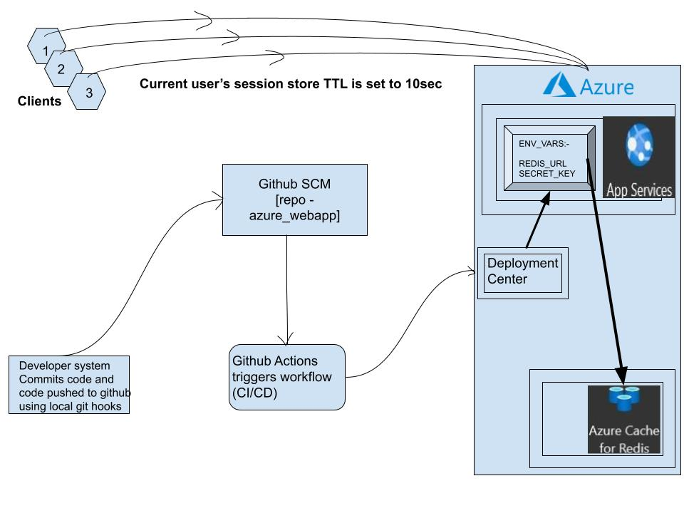

# azure_webappAzure App Service integration with Github Actions.

In a real world scenarios, instead of storing the username, generating a token and storing that token once a user is 
authenticated. That token will represent by the “Redis key” under which all the server side session data will be stored.
Environment Variables can also be stored in Vaults provided by the Azure cloud.
(https://docs.microsoft.com/en-us/azure/key-vault/secrets/about-secrets)

##References:-
https://azure.microsoft.com/en-us/services/cache/
https://azure.microsoft.com/en-us/services/app-service/
https://azure.microsoft.com/en-us/pricing/details/app-service/windows/
https://azure.microsoft.com/en-us/pricing/details/cache/
